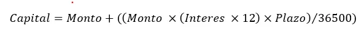

# Finanzas en Banca NET

Esta demostración se trata de una API Restful más una página que muestra un listado de clientes usando React Vite muy sencilla de cómo se utilizan algunas fórmulas o cálculos para diversas operaciones financieras de una entidad bancaria.En este ejemplo hacemos uso de .NET Core, como ORM Microsoft EF (**_Entity Framework Core_**) ([ver más](https://learn.microsoft.com/en-us/ef/)) y una base de datos PostgreSQL ([ver más](https://www.postgresql.org/)). 

## Algunas Capturas de Pantalla

 

 

 

 

---

**Importante**: Esta demostración no es una aplicación comercial. Se trata de una aplicación con fines pedagógicos.

---

## Operaciones

En esta ocasión he añadido tres áreas de operaciones. Una de ellas es para inversiones y otra es para el uso de débito automático y cuenta corriente.

### Plazo Fijo

La fórmula para obtener la rentabilidad a plazo se puede expresar de muchas formas distintas. Aquí detallaré las que son utilizadas en la República Argentina. Comencemos a describir algunos conceptos importantes.

- **_TNA (Tasa Nominal Anual)_** — Se trata de un indicador que es expresado en valores de porcentaje. Sencillamente resulta ser el valor de interéses anuales.
- **_TEA (Tasa Efectiva Anual)_** — Se trata de un indicador que nos ayuda a determinar el valor de un capital que obtendremos.

Por tanto, para poder obtener la TEA desde TNA tendremos que valernos de la siguiente ecuación:

**Donde tenemos:**

**_n_** — Meses de la tasa efectiva.

**_m_** — Período de la capitalización de la tasa nominal.

Por otra parte, como ya dijimos recientemente, el TNA se trata del valor de interés anualizado. Por ejemplo, si la tasa del banco anualizada es del 28%, el interés mensual será de 2.33%.

La fórmula que utilizo para esta demostración la he adaptado para poder realizar los cálculos en el sistema ajustando la fórmula como sigue a continuación.

**Donde tenemos:**

**_Capital_** — Es el valor que obtendremos al final del plazo.

**_Monto_** — Es el valor de capital ingresado antes de la finalización del plazo.

**_Plazo_** — La cantidad de días para el plazo.

**_Interes_** — Este es el valor de interés mensual. El interés cuando es mensual se requiere (Interés x 12) pero si es interés anual simplemente se escribe su valor.

Por ejemplo, supongamos que hacemos una inversión cuyo monto inicial es de $ 100.000,00 (pesos argentinos), el interés anual es de 23% y a un plazo de 30 días, ¿cuál es valor de capital final que tendremos? Veamos los siguientes cálculos.
